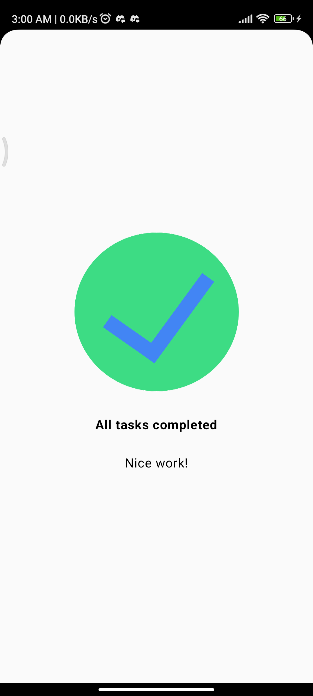

# Task Manager App

## Overview

This project is part of the Android Basics with Compose course by Google.

The goal of this task was to build a simple "Task Completed" screen using Jetpack Compose. The UI contains:

* A completed task image
* A bold completion message
* A supporting text message
* All content centered on the screen

---

## Problem Statement

[Google Android Developers Codelab: Task Manager app](https://developer.android.com/codelabs/basic-android-kotlin-compose-composables-practice-problems?continue=https%3A%2F%2Fdeveloper.android.com%2Fcourses%2Fpathways%2Fandroid-basics-compose-unit-1-pathway-3%23codelab-https%3A%2F%2Fdeveloper.android.com%2Fcodelabs%2Fbasic-android-kotlin-compose-composables-practice-problems#2)

---

## Screenshot

<p align="center">
  
</p>


---

## What I Learned

### Jetpack Compose Concepts

* Creating reusable composable functions.
* Using `Column` to arrange UI elements vertically.
* Using `Image` and `Text` composables.
* Applying text styling with `FontWeight.Bold`.
* Using `Modifier.padding()` for spacing.
* Understanding the purpose of `Modifier`.
* Using `horizontalAlignment = Alignment.CenterHorizontally`.
* Using `verticalArrangement = Arrangement.Center`.
* Understanding how parent layouts control child positioning.

### Important Layout Lesson

While building this project, I initially centered the image and text horizontally but the image was not vertically aligned with the text.

The issue was that the parent `Column` was not occupying the full screen.

Key takeaway:

* `Arrangement.Center` only works when the parent has available space.
* `Modifier.fillMaxSize()` allows the parent layout to occupy the entire screen.
* Once the parent `Column` filled the screen, all content was correctly centered.

### Modifier Understanding

I learned the difference between:

```kotlin
modifier: Modifier = Modifier
```

and

```kotlin
modifier.fillMaxSize()
```

The first provides an empty default modifier, while the second extends the modifier chain and allows the layout to use the available screen space.

---

## My Approach

I created separate composable functions for:

* Image UI
* Text UI

and then combined them using a parent `Column`.

This helped me understand composable hierarchy and parent-child layout relationships.

---

## Reference Solution

[Official Google training solution of Task Manager app Problem Statement](https://github.com/google-developer-training/basic-android-kotlin-compose-training-practice-problems/blob/main/Unit%201/Pathway%203/TaskCompleted/app/src/main/java/com/example/taskcompleted/MainActivity.kt)

---

## Note

My implementation differs from Google's reference solution in structure.

Google's solution places the image and text directly inside a single composable (`TaskCompletedScreen`), while my implementation separates the UI into reusable composable functions for the image and text and combines them through a parent layout.

I also used `Modifier.fillMaxSize()`, whereas Google's implementation uses `fillMaxWidth()` and `fillMaxHeight()` to occupy the available screen space.

Although the code structure is different, both implementations rely on the same Jetpack Compose layout principles:

* `Column`
* `horizontalAlignment = Alignment.CenterHorizontally`
* `verticalArrangement = Arrangement.Center`

As a result, both approaches produce the same final UI output.

This exercise helped me gain a better understanding of Compose layouts, modifiers, alignment, arrangement, parent-child relationships, and composable hierarchy.

